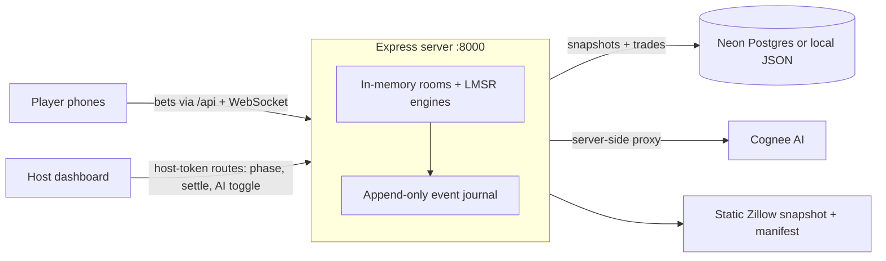

# FairValue

A live multiplayer real estate prediction market. Players use their phones to bet on whether a home will sell above or below its asking price. Their bets create a crowd-sourced fair value in real time.


A Zestimate uses one algorithm to estimate a home's value. FairValue asks a group of people instead. A host displays a real listing, and players scan a QR code to join from their phones. Each bet updates a Logarithmic Market Scoring Rule (LMSR) market maker, similar to those used in prediction markets. The group sees a live probability and implied price. When the final price is known, the market settles, scores each player's accuracy, and creates a public result that anyone can verify.

## What it does

- **Multiplayer rooms** — a host creates a room with a 4-character code. Players scan a QR code, open `/play/:roomCode`, and bet from their phones. The host dashboard at `/host/:roomCode` includes a live chart, leaderboard, activity feed, game controls, and projector mode.
- **LMSR market maker** — `src/lib/lmsr.ts` uses the cost function `b·ln(e^(qOver/b) + e^(qUnder/b))` and binary search to convert a dollar budget into shares. `src/lib/multiOutcomeMarketEngine.js` adds an n-outcome log-sum-exp engine for price-band markets. Tests confirm that the browser and server produce the same results.
- **Six market formats** — over/under asking price, price band, rent yield, time on market, renovation budget, and neighborhood price momentum. A versioned registry publishes them at `/api/market-templates`.
- **Contrarian AI bot** — an optional mean-reversion trader adds liquidity to small markets and keeps solo markets active.
- **Event history** — every bet, join, phase change, and settlement is stored in an append-only journal. The server can rebuild rooms after a restart. `/api/rooms/:code/replay/verify` checks that the current room matches its event history. Settled rooms also create a signed public record that anyone can verify without host access.
- **Reputation and accuracy** — settlement calculates a Brier-style score for each player. Signed-in users can view their private history at `/me`, manage watchlists and price alerts, and export room data as CSV.
- **Market Studio** — paste listing text at `/join` to create a draft with a standard address, asking price, evidence checklist, and warnings.
- **Real listing data** — `public/data/properties.json` contains a static Zillow snapshot of San Francisco listings. A manifest records source hashes, field coverage, and freshness. The app also provides neighborhood and location query APIs, with optional PostGIS support.

## How it works

One Express process (`server/index.js`, about 3,100 lines) handles all market calculations and room state. The React app is a lightweight real-time client.



- Rooms stay in memory for speed. Every change is also recorded in a journal and snapshot, so the server can restore play after a restart.
- The Vite development server sends `/api` and `/ws` traffic to the backend. WebSocket events (`bet`, `join`, `phase`, `ai_trade`, `settle`) keep phones and the projector in sync.
- Neon Postgres is optional. Without `DATABASE_URL`, multiplayer still works with local JSON snapshots.
- Only the host receives the room's access token. Public recap, verification, and export endpoints do not expose tokens, session IDs, or private evidence. End-to-end tests check this behavior.
- The server sends Cognee AI requests, so its credentials never reach the browser. Without a key, AI features use predictable local analysis.
- `sean/` contains the original FastAPI prototype that first tested the LMSR system. See `sean/ALGORITHM.md`.

## Tech stack

- **Frontend:** React 19, TypeScript, Vite, React Router 7, TradingView Lightweight Charts, Leaflet, `qrcode.react`
- **Backend:** Node.js, Express 5, `ws` WebSockets, and Neon serverless Postgres with optional PostGIS support
- **Testing:** Vitest, `node:test`, and Playwright for cross-browser, restart recovery, soak, load, and accessibility tests
- **Prototype:** Python + FastAPI (`sean/`)

## Run it locally

```bash
npm install

# Terminal 1 — backend on :8000
npm run server

# Terminal 2 — frontend on :5173 (proxies /api and /ws to :8000)
npm start
```

Open `http://localhost:5173/join`, create a room, and join from a phone on the same network. Local play does not require environment variables.

For the full setup, run `cp .env.example .env`. The file documents every variable. These are the most important:

- `DATABASE_URL` — stores markets and trades in Neon Postgres; run `node server/seed.js` to seed it
- `COGNEE_API_KEY` — enables Cognee AI analysis; use it only on the server, never in a `VITE_*` variable
- `FAIRVALUE_IDENTITY_SECRET` — signs browser identities for lasting host and player access
- `FAIRVALUE_ROOM_STORE` — saves room snapshots in `json` (default) or `postgres`
- `FAIRVALUE_OPS_TOKEN` — protects `/api/ops/metrics` and the production incident console

Useful checks:

```bash
npm test            # unit tests (Vitest)
npm run test:e2e    # Playwright browser flows
npm run verify      # secret scan, typecheck, tests, build, bundle budget, boot smoke
```

## Team / Built at

Built at the **DigitalOcean Hackathon**, where it won **1st place**.

- [Sean Chiu](https://github.com/seanchiuai)
- [Rishabh](https://github.com/rishabhcli)
- [Nightwolf](https://github.com/Nightwolf7570)
