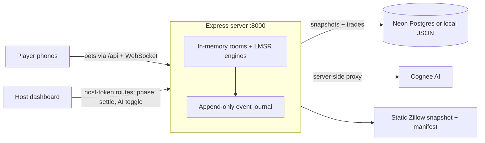

# FairValue

A live multiplayer prediction market for real estate: a room full of people bet from their phones on whether a home will sell over or under its asking price, and the market converges on a crowd-sourced fair value in real time.

**🏆 1st Place — DigitalOcean Hackathon**

A Zestimate is one algorithm's opinion of what a house is worth. FairValue asks a room of humans instead. A host puts a real listing on the projector, players scan a QR code to join from their phones, and every bet moves a Logarithmic Market Scoring Rule (LMSR) market maker — the same mechanism behind Polymarket-style prediction markets — so the group's belief shows up as a live probability and an implied price. When the real number comes in, the market settles, players get scored on calibration, and the room gets a verifiable public recap.

## What it does

- **Multiplayer rooms** — host creates a room and gets a 4-character code; players join via QR code at `/play/:roomCode` and bet from their phones. The host dashboard (`/host/:roomCode`) shows a live dual-axis chart (probability + implied fair value), leaderboard, activity feed, phase/timer/lock controls, and a projector mode for the big screen.
- **A real LMSR market maker** — cost function `b·ln(e^(qOver/b) + e^(qUnder/b))` with binary search from dollar budget to shares (`src/lib/lmsr.ts`), plus a generic n-outcome log-sum-exp engine (`src/lib/multiOutcomeMarketEngine.js`) for price-band markets. The browser math is parity-tested against the server engine.
- **Six playable market formats** — over/under asking price, price band, rent yield, time on market, renovation budget, and neighborhood price momentum, all published through a versioned template registry at `/api/market-templates`.
- **A contrarian AI bot** — mean-reversion trader (toggleable per room) that keeps thin markets liquid and gives solo markets 24/7 activity.
- **Event-sourced rooms** — every bet, join, phase change, and settlement is a canonical event in an append-only journal. Rooms survive backend restarts via replay, `/api/rooms/:code/replay/verify` proves the live state matches the event stream, and settled rooms emit an HMAC-signed public verification artifact anyone can audit without host credentials.
- **Reputation and calibration** — settlement computes Brier-style calibration per player; signed-in users accumulate a private cross-room record at `/me`, alongside watchlists, price-threshold alerts, and a room library with CSV export.
- **Market Studio** — paste raw listing text at `/join` and get a draft market with normalized address, asking price, evidence checklist, and warnings before creating the room.
- **Real listing data** — a static Zillow snapshot of SF listings (`public/data/properties.json`) with a deterministic provenance manifest (source hashes, field coverage, freshness), plus neighborhood/geospatial query APIs and an optional PostGIS projection.

## How it works

One Express process (`server/index.js`, ~3,100 lines) owns all market math and room state; the React app is a thin real-time client.



- Rooms live in memory for speed; every mutation is journaled and snapshotted, so a restart replays the event log and play continues.
- The Vite dev server proxies `/api` and `/ws` to the backend; WebSocket broadcasts (`bet`, `join`, `phase`, `ai_trade`, `settle`) keep every phone and the projector in sync.
- Postgres (Neon) is optional: without `DATABASE_URL` the server boots in a degraded mode where multiplayer still fully works on JSON snapshots.
- Host authority is a capability token returned only at room creation; public endpoints (recap, verification, exports) are built to never leak tokens, session IDs, or private evidence — and the e2e suite checks that.
- Cognee AI calls are proxied server-side so credentials never reach the browser; without a key, intelligence features fall back to deterministic local analysis.
- `sean/` holds the original FastAPI prototype where the LMSR mechanics were first proven (see `sean/ALGORITHM.md`).

## Tech stack

- **Frontend:** React 19, TypeScript, Vite, React Router 7, TradingView Lightweight Charts, Leaflet, `qrcode.react`
- **Backend:** Node.js, Express 5, `ws` WebSockets, Neon serverless Postgres (optional PostGIS projection)
- **Testing:** Vitest, `node:test` server suites, Playwright e2e (cross-browser matrix, restart-recovery, soak, load, axe accessibility)
- **Prototype:** Python + FastAPI (`sean/`)

## Run it locally

```bash
npm install

# Terminal 1 — backend on :8000
npm run server

# Terminal 2 — frontend on :5173 (proxies /api and /ws to :8000)
npm start
```

Open `http://localhost:5173/join`, create a room, and join it from your phone on the same network. No env vars are required for local play.

For the full setup, `cp .env.example .env` (every variable is documented there). The ones that matter most:

- `DATABASE_URL` — Neon Postgres for durable markets/trades (`node server/seed.js` to seed)
- `COGNEE_API_KEY` — enables Cognee-backed AI analysis (server-side only, never `VITE_*`)
- `FAIRVALUE_IDENTITY_SECRET` — signs browser identities for durable host/player authority
- `FAIRVALUE_ROOM_STORE` — `json` (default) or `postgres` for room snapshot persistence
- `FAIRVALUE_OPS_TOKEN` — guards `/api/ops/metrics` and the incident console in production

Useful checks:

```bash
npm test            # unit tests (Vitest)
npm run test:e2e    # Playwright browser flows
npm run verify      # secret scan, typecheck, tests, build, bundle budget, boot smoke
```

## Team / Built at

Built at the **DigitalOcean Hackathon**, where it took **1st place**.

- [Sean Chiu](https://github.com/seanchiuai)
- [Rishabh](https://github.com/rishabhcli)
- [Nightwolf](https://github.com/Nightwolf7570)
